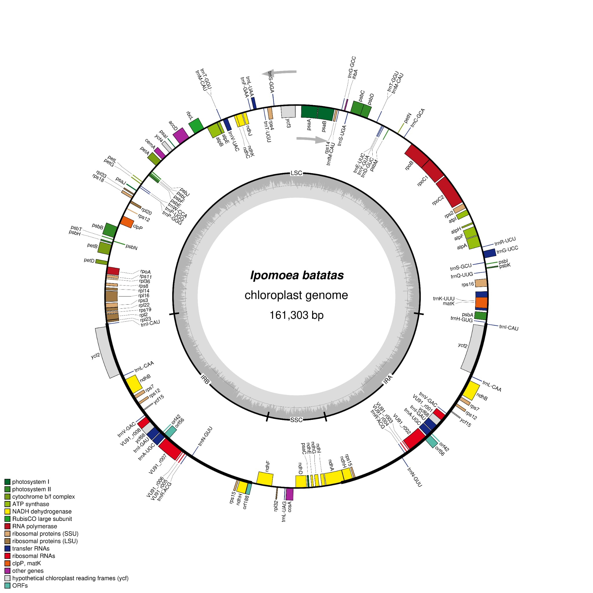

# Lab Activity: Visualize Plastid Genome Structure

## Student Information
- **Student Name:** Ray Gee J. Lisondra
- **Course and Section:** Cell and Molecular Biology - A

## Organism & Genomic Details
- **Scientific Name:** *Ipomoea batatas* (cultivar Xushu 18)
- **NCBI Accession Number:** NC_026703.1
- **Plastid Genome Length:** 161,303 base pairs (bp)
- **Source of Genome File:** NCBI GenBank database

## Visualization Software & Settings
- **Software Used:** OGDRAW (OrganellarGenomeDRAW)
- **OGDRAW Settings:** 
  * Standard map mode selected.
  * Circular genome map type and Plastid sequence source chosen.
  * Automatic detection option used for inverted repeats.
  * Configured options enabled to draw the GC content graph, show the direction of transcription, display the full legend, and label intron-containing genes with an asterisk.
  * Output format set to PNG.

## Plastid Genome Map

## Structural Description
The chloroplast genome of *Ipomoea batatas* spans 161,303 bp and displays the classic angiosperm quadripartite structure. It consists of a Large Single-Copy (LSC) region and a Small Single-Copy (SSC) region separated by two symmetrical Inverted Repeat ($\text{IR}_A$ and $\text{IR}_B$) regions. The map highlights functional gene clusters—including photosystem components, ATP synthases, and ribosomal proteins—alongside distinct regional variations in GC content highlighted in the inner graph.

## Repository File Links
- **Answers File:** [Lab Plastid Genome Answers](answers/Lab_plastid_genome_answers.md)
- **Input GenBank File:** Stored in the `data/` folder.
- **Genome Map Image:** Stored in the `figures/` folder.
